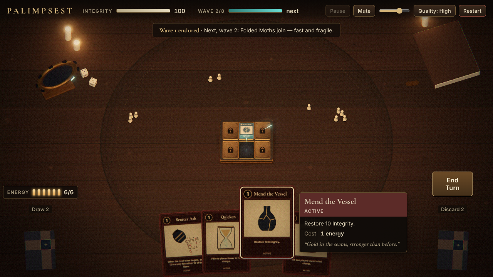
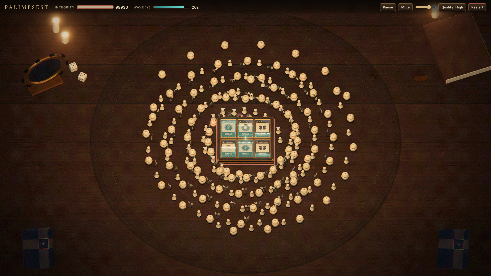

# PALIMPSEST

*Reclaim your memories. Endure eight waves. Return to life.*

A browser defense deckbuilder played on a wooden table lit by a single candle. In an afterlife
between death and new life, a soul defends an antique reincarnation instrument: a carved reliquary
Base with six card sockets (two open at the start of a run). Tower cards seated in the sockets fill
with turquoise light from bottom to top and fire on their own from a shared emitter. Small bone
game-piece foes walk in out of the fog at the table's edge, throwing long candle shadows. Between
waves, time freezes for a turn: you draw 4, get 6 energy, play cards, and sacrifice or purge cards
to reshape your deck.

Built with Three.js r186 (WebGL2), TypeScript (strict), Vite and Vitest. No backend, no paid or
downloaded assets: every texture, model, effect and sound is generated procedurally at runtime.





## Run it

Requires Node **22.12+** (or 24+).

```bash
npm ci            # install the locked dependency tree
npm run dev       # http://127.0.0.1:5173
npm run typecheck # tsc --noEmit (strict)
npm test          # Vitest: simulation, deck, turn loop, balance report
npm run build     # typecheck + production build, published to the repo root for GitHub Pages
npm run preview   # serve dist/ at http://127.0.0.1:4173
npm run balance   # print the whole-run balance table (scripted turn policies)
npm run smoke     # Playwright browser smoke suite against the dev server
node tools/fullrun.mjs http://127.0.0.1:4173/ low - 960x540   # one whole run with ordinary inputs
```

A desktop browser with WebGL2 is required; otherwise the page shows a support message.

## GitHub Pages

Pages serves the `palimpsest` branch **directly from the repository root**: the root
`index.html` and `assets/` are the built game (relative paths, bundled fonts, no service calls).

* Source lives in `src/` (dev entry `src/index.html`). Never edit the root `index.html` or
  `assets/` by hand.
* `npm run build` = typecheck → `vite build` into `dist/` → `tools/publish.mjs` copies the build
  to the root. Commit the regenerated `index.html` + `assets/` with the source change.
* `.github/workflows/pages.yml` is the safety net: on every push to `palimpsest` it runs the
  tests, rebuilds, and commits the build if it was stale.

## How to play

**The turn loop.** A run opens with a turn before wave 1. Each turn:

* draw **4** cards (your opening hand always contains your tower card);
* energy refills to **6**; tower cards cost **3**, common cards cost **1**;
* play as many cards as you can afford, then press **End Turn**: unplayed cards go to the
  discard pile and the next 30-second wave starts. When the draw pile runs out, the discard pile is
  shuffled back in.

**Cards.** Colour tells the type at a glance:

| Type | Colour | Behaviour |
|---|---|---|
| Tower | muted dark blue | seats in an open socket; fires automatically; leaves the deck. Playing a tower on an occupied socket asks to **Replace** — the old tower is destroyed. |
| Active | muted dark red | permanent: a repeating effect with its own cooldown during waves, shown as an icon at the top right that fills like a tower. Every extra copy divides the cooldown (2 copies fire twice as often). Leaves the deck. |
| Passive | muted dark brown | adds a permanent run-wide modifier each time it is played, then goes to the discard pile, so it comes back and stacks again. |
| Dust | grey | filler that does nothing and cannot be played; only good for sacrifice (or purge). |

Played towers and actives leave the deck; passives and unplayed cards go to the discard pile and
come back when the draw pile is reshuffled. **The deck never drops below 4 cards:** if it holds
fewer when a turn starts, Dust is shuffled in until it has 4.

**Sacrifice and purge.** Right-click cards to mark them (red outline).

* Two marked → **Sacrifice**: both leave the deck and you choose 1 of 3 new cards (any type). If
  the two were the same card, one offer is guaranteed to be that card (the hook for future upgraded
  rarities). Unlimited per turn.
* One marked → **Purge** removes it from your deck. Once per turn.

New cards only enter the deck through sacrifice. You start with 10 cards: the Memory Needle tower,
two Quickened Pulse, two Sharpened Grief, Far Remembrance, Sturdy Vessel, two Stray Memory and
Mend the Vessel.

**Controls**

| Input | Action |
|---|---|
| Drag a card | towers: onto a socket; other cards: up out of the hand to play |
| Click a card | play it (towers then wait for a socket click) |
| Right-click a card | mark/unmark for sacrifice or purge |
| Hover a card | lift it and read its tooltip; the hand tucks away when the pointer leaves it |
| Hover a placed tower | its attack range is drawn around the Base, with a tooltip of its current Damage, DPS, Attack speed, Range, Target type and Projectiles (all modifiers applied) |
| Tab | show/hide the modifier panel during a wave (always shown during a turn) |
| 1 · 2 · 3 (or the 1×/2×/3× buttons) | time speed |
| Mouse wheel / Z | zoom toward the cursor / reset zoom (the camera never zooms by itself) |
| E | End Turn |
| Esc | cancel targeting/replace, clear marks; in combat, pause |
| P · M · Q | pause · mute · High/Low quality |

## Content (placeholder balance)

| Tower | Behaviour |
|---|---|
| Memory Needle | the all-rounder: 0.9 s, 6 dmg, range 14, homing needle (1 projectile) |
| Last Light | 2.6 s, 30 dmg, range 22, instant lance |
| Kindred Thread | 2.0 s, 9 → 7 → 5 chained through up to 3 foes, range 13 |
| Mercy Bell | 2.8 s, 10 dmg to every foe within 8.5 of the Base |

| Passive (permanent, card cycles back) | Effect |
|---|---|
| Quickened Pulse | +5% attack speed for all towers |
| Sharpened Grief | +5% damage for all towers |
| Far Remembrance | +5% range for all towers |
| Sturdy Vessel | +5% max Integrity (and restores the added amount) |

| Active (permanent, repeats during waves) | Effect |
|---|---|
| Stray Memory | every 4 s: strike a random foe for 50% of the average DPS of your placed towers |
| Mend the Vessel | every 8 s: restore 5 Integrity |

Modifiers add up (ten plays of Quickened Pulse = +50% attack speed). DPS is damage per second against one
foe per hit (a chain counts every hop). Actives hold when they have nothing to do (no foes, no
towers, or full Integrity).

| Foe (game piece) | HP | Speed | Contact |
|---|---:|---:|---:|
| Veiled Echo — hooded bone pawn | 6 | 0.9 | 3 |
| Folded Moth — peg piece with wing plates | 3 | 1.4 | 2 |
| Burden Urn — stacked jar with brass bands | 24 | 0.5 | 8 |

Foes spawn on a ring of radius 24 around the Base and walk straight in; soft collision spreads
the swarm. HP scales `1 + 0.1·(wave−1)`. Only two sockets are open; unlocking more is a future
feature. See [docs/TUNING.md](docs/TUNING.md).

## Architecture

```
src/
  main.ts               lifecycle: render loop, fixed-step bridge, events → views, restart/teardown
  game/                 pure, deterministic, DOM/Three-free
    content.ts          ALL tuning data: towers, active/passive cards, costs, deck, foes, 8 waves
    deck.ts             draw/hand/discard with reshuffle; opening-hand tower guarantee; Dust top-up;
                        sacrifice offers
    phases.ts           the single controller: TITLE/TURN/COMBAT/PAUSED/CLEARING/DEFEAT/VICTORY,
                        playing cards, energy, sacrifice, purge, end turn
    simulation.ts       fixed 1/60 s combat step (see below), soft collision, slot locks, wave modifiers
    clock.ts, rng.ts, types.ts
  view/
    scene.ts            renderer, square ortho camera (player zoom only), candle key light, composer chain
    board.ts            wooden table, inked arena, candle + book, fog veil, reliquary Base, sockets, range ring
    hand.ts             the physical hand in its own overlay pass, piles, sacrifice offers
    cards.ts            socketed tower cards with per-card charge overlays
    cardAssets.ts       shared card geometry, faces and type-coloured edges
    enemies.ts          instanced game-piece foes (stable id→instance mapping)
    art.ts              procedural card faces (type-coloured, print-finished), table and piece textures
  input/cardInteraction.ts   hand-first picking, drag/click play, right-click marks, wheel zoom
  fx/effects.ts, fx/audio.ts pooled cosmetic effects (dimmed while frozen); synthesized audio
  game/stats.ts              effective tower numbers after modifiers (used by the sim and every tooltip)
  ui/hud.ts, styles.css      top bar, time speed, active icons, modifier panel, energy, piles, End Turn,
                             action bar, tooltip, overlays
  dev/devApi.ts              test API (dev builds or `?dev`)
```

**Render chain.** World `RenderPass` (half-float, MSAA on High) → **hand overlay `RenderPass`**
(separate scene/camera, depth cleared — world objects can never draw over your cards) →
`UnrealBloomPass` (High) → `OutputPass` (tone map + sRGB once) → grade pass (slight desaturation,
warm shadows, deep vignette). The candle is the one shadow-casting light; a fog veil just above the
pieces darkens the table toward its edges, so foes emerge from the dark.

**Deterministic step order** (one tick = 1/60 s): 1 spawns → 2 movement, 2b soft separation (grid hash, stable ID order, capped pushes, never shoves
a foe into the Base) → 3 towers charge/fire in stable creation order → 3b active cards in first-played order →
4 projectiles → 5 dead
cleanup → 6 contact damage → 7 defeat → 8 wave clock (boundary → turn; wave 8 → clearing → victory).
Turns freeze the simulation completely; card motion, hand animation and dust use presentation time.
Time speed (2×, 3×) runs proportionally more fixed steps per frame; the simulation itself is
unchanged.

## Testing

* `npm test` — 60 Vitest checks across `tests/simulation.test.ts`, `tests/deck.test.ts`,
  `tests/phases.test.ts` and the balance report.
* `npm run smoke` — Playwright drives the real canvas and DOM through the turn loop, combat, pause,
  boundaries, replace, sacrifice/purge, suspension, defeat/victory/restart, resolutions, Low
  quality, the charge fixture and a 300-foe swarm stress. Results: `tools/out/smoke-report.json`,
  screenshots: `docs/screenshots/`.

See [docs/VERIFICATION.md](docs/VERIFICATION.md) for the latest evidence and limitations.

## Versions

three 0.186.1 · @types/three 0.186.0 · vite 7.3.6 · typescript 5.9.3 · vitest 5.0.3 ·
playwright 1.56.1 · @fontsource/cormorant-garamond, @fontsource/inter 5.3.0 — pinned in
`package.json`, locked in `package-lock.json`.

## License

Code: MIT (`LICENSE`). Fonts: SIL OFL 1.1. All artwork and sound are original procedural assets;
see [ASSETS.md](ASSETS.md). The defense/deckbuilding rhythm is inspired by *Heretic's Fork* and the
tabletop mood by *Inscryption*; no assets, text or code from either were used.
