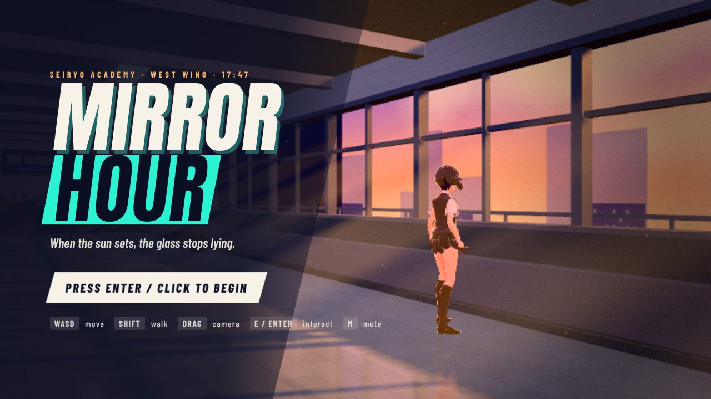
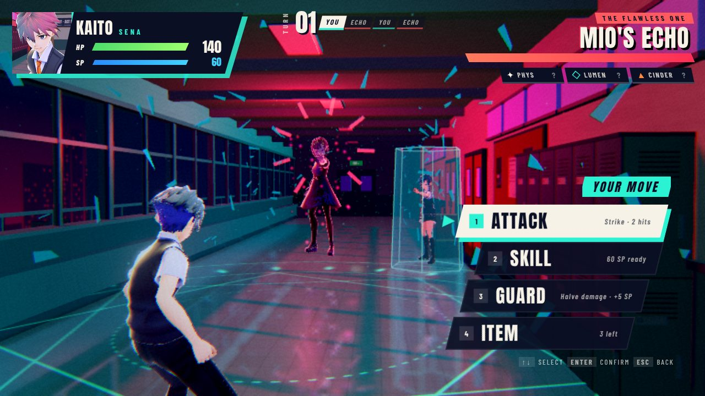

# MIRROR HOUR

*A stylized third-person school RPG encounter, built with Three.js.*

It is 17:47 at Seiryo Academy. The west corridor is empty except for the class rep,
Mio Tachibana, still staring out of the window. Walk over and talk to her. Her
reflection is not doing what she does.

This is a single, polished vertical slice:

1. **Explore** a sunset-lit school corridor in third person.
2. **Talk** to a student in a staged, voiced-blip conversation with cinematic shots.
3. **Transition**: the window cracks, the frame freezes and shatters into glass, and the
   corridor turns into its otherworld version.
4. **Fight** a turn-based battle against *Mio's Echo*: weaknesses, a stagger state,
   a telegraphed big attack, a mid-fight affinity shift, items and guarding.
5. **Resolve**: a victory sequence with an epilogue, or defeat with an instant retry.




All characters, names, symbols, UI, music and story are original. See
[ASSETS.md](ASSETS.md) for licences and trade-offs.

## Run it

You need **Node.js 18+** (no `npm install` is needed to play; all runtime libraries are vendored).

| OS | Launch |
|---|---|
| Windows | double-click `start.bat` |
| macOS | double-click `start.command` (or run `./start.sh`) |
| Linux | `./start.sh` |
| any | `node server.mjs`, then open <http://localhost:5173/> |

To put it on your Desktop, clone or copy this folder there
(`git clone -b schoolfight2 https://github.com/Lambiiz/Lambiiz.github.io ~/Desktop/mirror-hour`)
and run the launcher inside it.

The game is a static site, so any static file server works, as does GitHub Pages.
On weaker GPUs, open `http://localhost:5173/?q=low`. This mode lowers the resolution,
the reflection and the shadow quality.

## Controls

| | Exploration | Battle |
|---|---|---|
| Move / navigate | **WASD** or arrows | **↑ ↓** (or W/S), or the mouse |
| Walk (hold) | **Shift** | |
| Camera | drag with the mouse, wheel to zoom | |
| Interact / confirm | **E**, **Enter**, **Space** or click | **Enter**, **Space**, **Z** or click; **1–4** for commands |
| Back | | **Esc**, **Backspace**, **X** or right-click |
| Mute | **M** | **M** |

## The battle

| Command | Effect |
|---|---|
| **Attack** | Strike, a free two-hit combo with a chance to crit |
| **Skill** | *Lumen Edge* (8 SP, light) or *Cinder Verse* (10 SP, fire) |
| **Guard** | Halves incoming damage this round and restores 5 SP |
| **Item** | *Melon Soda* ×2 (+45 HP) or *Mint Drops* ×1 (+22 SP) |

- **Affinity chips** on the enemy card start as `?` and fill in as you discover them.
  Hitting a **WEAK** point deals 1.5× damage and **CRACKS** the Echo, so it skips its
  next turn (no stun-locking). **RESIST** halves damage.
- When the Echo is *holding its breath*, its next move is **Perfect Score**. Guard.
- At half HP it casts **Mirror Glaze** and its affinities flip. Mio calls out a hint
  from inside her crystal.
- A good fight lasts about 6–9 turns. In 2,000 simulated battles, a player who reads
  the affinities wins 100% of the time; random play wins about 58%.

## Project structure

```
index.html            page shell + import map
server.mjs            zero-dependency static server (launchers call this)
styles/               main.css (HUD, dialogue), battle.css (battle UI), fonts.css
src/
  main.js             boot
  core/               Game (state machine + loop), Input, Post (bloom + grade shader),
                      CameraRig (cinematic camera), Tasks (game-time scheduler), math
  assets/             AssetLoader (VRM + animation library), retarget.js (UAL → VRM)
  characters/         Character (crossfades, expressions, head-look, pose overlays),
                      EchoLook (enemy material restyle)
  world/              SchoolHallway (environment, lighting, otherworld mode), textures.js
  explore/            PlayerController (movement + collision), FollowCamera
  dialogue/           DialogueSystem (staging, shots, cues)
  transition/         BattleTransition (crack → capture → shatter → title card)
  battle/             BattleSystem (pure rules), BattleDirector (staging / VFX / cameras)
  ui/                 HUD, DialogueBox, BattleUI, dom helpers
  fx/                 Effects (particles, slashes, blades, glyphs, shields, damage pops)
  audio/              Audio (synthesised SFX + generative music)
  data/               battleData, dialogue, spots
assets/               models (VRM), anim (GLB), fonts
vendor/               three.js r170 + @pixiv/three-vrm (ES modules)
tests/                battle.test.mjs (rules + balance simulation)
tools/                e2e.mjs (full Playwright playthrough), assetcheck.html, shot.mjs
```

## Testing

```bash
node tests/battle.test.mjs        # rules + 2,000-battle balance simulation
npm install                       # dev only: installs Playwright for the e2e test
node server.mjs &                 # then, in another shell:
node tools/e2e.mjs docs/screenshots
```

`tools/e2e.mjs` plays the whole slice in headless Chromium using only keyboard input.
It checks movement, wall collision on both walls, the talk prompt, all dialogue lines,
the transition, menu navigation (including backing out of a sub-menu), weakness
discovery and stagger, the phase-2 shift, enemy attacks, victory and the epilogue,
restart, the defeat path, and retry. Screenshots and `e2e-report.json` go to the output
folder. `tools/assetcheck.html` renders the cast side by side, playing any clip, to
validate retargeting.

The last full run passed **23/23 checks** with no runtime errors
(`docs/screenshots/e2e-report.json`). Curated frames from that run are in
`docs/screenshots/`.
