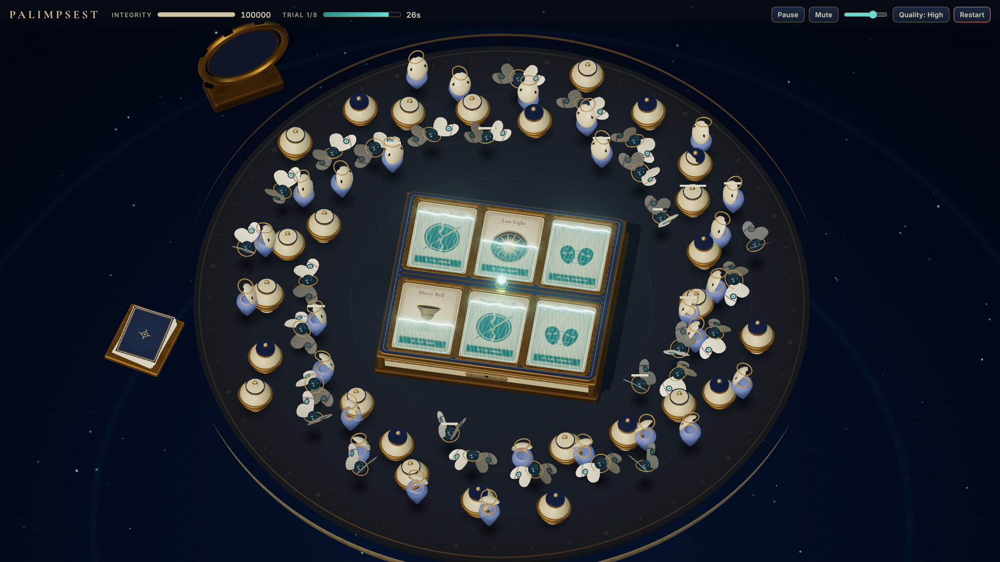
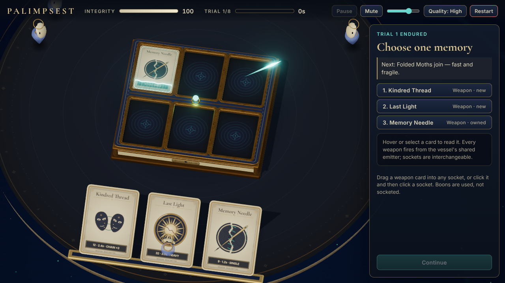

# PALIMPSEST

*Reclaim your memories. Endure eight trials. Return to life.*

A small, complete browser vertical slice: in an afterlife between death and new life, a soul
defends an antique reincarnation instrument — a ceramic-and-brass jewelry-box Base with exactly
six card sockets. Each socketed **memory card** is a weapon. Its printed face fills with turquoise
light from bottom to top; when full, the Base's shared soul emitter fires and that card empties.
Every 30 seconds the encounter freezes, you choose one of three cards to grow your build, and the
same encounter resumes. Survive eight trials (the eighth ends in a clearing period) to be reborn.

Built with Three.js r186 (WebGL2), TypeScript (strict), Vite and Vitest. No backend, no paid or
downloaded assets: every texture, model, effect and sound is generated procedurally at runtime.





## Run it

Requires Node **22.12+** (or 24+) — Vite 7 needs 20.19+/22.12+, Vitest 5 needs 22.12+.

```bash
npm ci            # install the locked dependency tree
npm run dev       # http://127.0.0.1:5173
npm run typecheck # tsc --noEmit (strict)
npm test          # Vitest: deterministic simulation, phase and balance checks
npm run build     # typecheck + production build into dist/ (relative base, static hostable)
npm run preview   # serve dist/ at http://127.0.0.1:4173
npm run balance   # print the whole-run balance table (scripted draft policies)
npm run smoke     # Playwright browser smoke suite against the dev server (see below)
node tools/fullrun.mjs http://127.0.0.1:4173/ low - 960x540   # one whole run with ordinary inputs
```

A desktop browser with WebGL2 is required; if it is unavailable the page shows a support message.

## How to play

* **Begin the Trials** starts a run (and unlocks audio).
* Combat is automatic. Each weapon card charges independently and fires from the shared emitter
  at the nearest threat (smallest distance to the Base's rectangular footprint).
* At the end of trials 1–7 everything freezes and three memory cards rise from the stack:
  * **Drag** a weapon card into any socket, **or click** it and then click a socket.
  * Dropping on an occupied socket shows a comparison and requires **Replace** (or **Cancel**).
  * **Boons** (Polished Memory, Mend the Vessel) are applied with **Use**; they never take a socket.
  * After one reward resolves, press **Continue**. The trial resumes exactly where it froze.
* Trial 8 stops spawning at 30 s; clear the field to open the return aperture.
* Integrity 0 is defeat. **Restart** is always available.

| Key | Action |
|---|---|
| P / Esc | Pause / resume (Esc also cancels a held card in drafts) |
| M | Mute |
| Q | Toggle High/Low quality |
| 1–3 | Choose an offered card |
| 1–6 | Place the selected card in a socket |

Hover any card (during combat too) to read full stats in the DOM detail panel. Equipped cards can
be inspected during combat but never moved.

## The four weapons and three foes

| Weapon | Behavior | Identity |
|---|---|---|
| Memory Needle | 1.2 s · 9 dmg · range 11 · homing projectile (speed 18, life 2 s, retargets once) | turquoise needle with tapered trail, dry glass tick |
| Last Light | 3.0 s · 32 dmg · range 11 · instant lance | lens contraction + ivory/gold lance, low resonant strike |
| Kindred Thread | 2.4 s · 12/9/7 to up to 3 distinct foes, hops ≤ 3.2 | seeded forked blue ribbons with bright core, soft electrical chord |
| Mercy Bell | 3.2 s · 16 dmg to all within 6.8 of the Base centre | coral/gold expanding ring and inner ripple, muted bronze bell |

| Foe | HP | Speed | Contact | Silhouette |
|---|---:|---:|---:|---|
| Veiled Echo | 18 | 0.7 | 6 | hollow ceramic mask above a tapering translucent veil, brass halo |
| Folded Moth | 10 | 1.15 | 4 | fast-flapping engraved wings around a dark pearl |
| Burden Urn | 65 | 0.4 | 14 | lathed urn with enamel lid and dark brass bands, waddling gait |

HP scales `1 + 0.1·(trial−1)`. See [docs/TUNING.md](docs/TUNING.md) for the trial schedule,
balance report and every deviation from the starting numbers.

### About the deckbuilding

The build is a **Memory Deck that is exactly what you have socketed**: each draft adds or replaces
one card permanently (or applies a one-time boon). There is deliberately **no hand, draw pile,
discard/reshuffle economy, mana, rarity ladder or inventory**. The defense/drafting rhythm is
inspired by *Heretic's Fork*, but this slice does **not** reproduce its draw/discard economy.

## Architecture

```
src/
  main.ts               lifecycle: renderer loop (setAnimationLoop), fixed-step bridge, events → views, restart, teardown/HMR
  game/                 pure, deterministic, DOM/Three-free
    types.ts            records + typed SimEvent union
    content.ts          ALL tuning data: weapons, boons, enemies, 8 trial definitions, Base/arena dims
    rng.ts              mulberry32 + independent named streams (offers / spawns / cosmetic)
    simulation.ts       fixed 1/60 s combat step (spawns → move → weapons → projectiles → cleanup → arrivals → defeat → clock)
    clock.ts            accumulator: clamp 0.1 s, ≤ 6 steps/frame, stop on any non-continue outcome
    draft.ts            seeded three-card offers with the eligibility rules
    phases.ts           the single phase controller (TITLE/COMBAT/DRAFT/PLACEMENT/PAUSED/CLEARING/DEFEAT/VICTORY)
  view/                 rendering only observes simulation state/events
    scene.ts            WebGLRenderer, ortho camera fit, lights, RoomEnvironment PMREM, composer chain, quality, resize
    board.ts            board, rim, Base (pedestal, enamel lid with 6 beveled sockets, seam, emitter), aperture, stack
    cards.ts            physical cards, springs, tray, drag, discard/consume, per-card charge overlay
    chargeMaterial.ts   the card-surface charge ShaderMaterial
    enemies.ts          InstancedMesh miniatures with stable id→instance mapping, blob shadows, damaged-only HP bars
    art.ts              procedural engraved CanvasTexture artwork (cached once per definition)
    layout.ts, quality.ts
  input/cardInteraction.ts   Pointer Events, capture, raycast against explicit targets, drag plane, click fallback
  fx/effects.ts         pooled ribbons/rings/particles/shards/needle trails (cosmetic only)
  fx/audio.ts           synthesized Web Audio, voice cap, combat bus fade, stopAll on restart
  ui/hud.ts, styles.css DOM HUD, draft/detail panel, overlays
  dev/devApi.ts         small test API (dev builds or `?dev`)
tests/                  Vitest (simulation, phases/offers, balance report)
tools/smoke.mjs         Playwright browser suite; tools/shot.mjs, tools/zoom.mjs capture helpers
```

### Deterministic step order (one fixed tick = 1/60 s)

1. Scheduled spawns (only while the trial clock is spawning; fractional progress retained).
2. Enemy movement straight toward the Base centre (XZ).
3. Weapons charge and fire **in stable creation-ID order** (never slot order). Instant damage
   (lance/chain/ring) resolves as each weapon fires, so later weapons ignore a just-killed foe.
   A weapon with no valid target clamps at full and holds; it fires once on reacquisition and
   restarts from zero. Overshoot of a normal shot is preserved (≤ one tick).
4. Projectiles travel (homing, arrival threshold covers the whole step so they cannot tunnel)
   and resolve hits; damage is captured at launch.
5. Dead cleanup (deaths are marked and announced immediately).
6. Surviving enemies whose circle touches the rectangular footprint deal contact damage once
   and dissolve (no kill credit).
7. Defeat check — defeat overrides a simultaneous phase change.
8. Phase clock: trial boundary → DRAFT; trial 8 end → CLEARING; empty field in clearing → VICTORY.

The frame loop stops stepping immediately on any non-continue outcome and clears the
accumulator. Frozen states render the authoritative transform (interpolation α = 1). Combat
effects, enemy gait and card fire pulses age with simulation time; card springs, camera
transitions and void dust use presentation time. Visibility loss suspends (PAUSED for combat,
an overlay flag for drafts that preserves the unresolved offer/replacement) and resumes only via
an explicit **Resume** with a reset frame clock — no catch-up.

### Rendering notes

* `three@0.186.1` only (one copy), WebGLRenderer + `three/addons` from the same package.
* Composer: `RenderPass` into a half-float render target with 4× MSAA on High (Low drops MSAA) →
  `UnrealBloomPass` (High only) → `OutputPass` (always on: ACES Filmic + sRGB conversion once).
* Card charge overlay: unlit `ShaderMaterial`, premultiplied normal blending for the tint plus a
  controlled HDR meniscus/edge/filament term; depth-tested, no depth write, polygon offset.
  `y=0` is the printed bottom; exact `q=0` and `q=1` endpoints are handled explicitly. Each card
  owns its own material/uniforms. `colorspace_fragment` is included (a no-op into the linear
  render target in r186; `OutputPass` does the display transform).
* Shadows: one 2048 (High) / 1024 (Low) `PCFShadowMap` directional light framed tightly on the
  Base; enemies use pooled blob shadows. `RoomEnvironment` → PMREM provides local metal reflections.
* Enemies are batched per archetype with `InstancedMesh` (stable logical-id → instance index,
  conservative bounds).

## Testing

* `npm test` — 38 Vitest checks: cadence (10 shots in 12 s), 30/60/144/45.7 FPS schedule
  equivalence, pause time excluded, stall clamp, hold-full/reacquire, independent duplicates,
  six-slot permutation invariance, needle travel/retarget/launch damage, chain hop rules, bell
  readiness, polish multiplier, same-tick death vs contact, edge/corner contact, defeat override,
  clearing/victory, spawn interpolation, the full phase controller (freeze, continue, atomic
  placement/replacement, boons, suspension, restart), offer rules over 400 seeds × 7 drafts, RNG
  stream independence, and the whole-run balance report.
* `npm run smoke` — Playwright drives the real canvas and DOM: start, normal-time combat, boundary
  freeze, invalid drop, pointer cancel, click-to-place with double click, drag-to-place, replace
  preview/cancel/confirm, boons, pause, visibility suspension, defeat/victory/restart, ten-restart
  resource plateau, three resolutions, Low quality, charge fixture, stress fixture — 40 checks.
  Results land in `tools/out/smoke-report.json` and screenshots in `docs/screenshots/`.
* `tools/fullrun.mjs` — plays one entire eight-trial run with real drags/clicks only (no
  fast-forward) and restarts from the ending.
* Developer API (dev server, or any build with `?dev`): `window.__PALIMPSEST__` exposes snapshots,
  `chargeFixture()`, `attackPose()`, `stressFixture()`, projected card/socket positions,
  `resources()` and `perf()`. `?seed=N` replays a displayed seed.

See [docs/VERIFICATION.md](docs/VERIFICATION.md) for the latest evidence and known limitations.

## Versions

| Package | Version |
|---|---|
| three | 0.186.1 (r186) |
| @types/three | 0.186.0 |
| vite | 7.3.6 |
| typescript | 5.9.3 |
| vitest | 5.0.3 |
| playwright | 1.56.1 (Chromium build 1194) |
| @fontsource/cormorant-garamond, @fontsource/inter | 5.3.0 |

Exact versions are pinned in `package.json` and locked in `package-lock.json`.

## License

Code: MIT (`LICENSE`). Fonts: SIL OFL 1.1. All artwork and sound are original procedural assets;
see [ASSETS.md](ASSETS.md).
